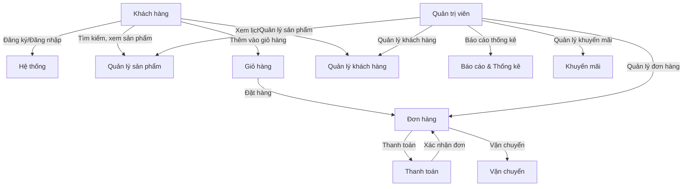
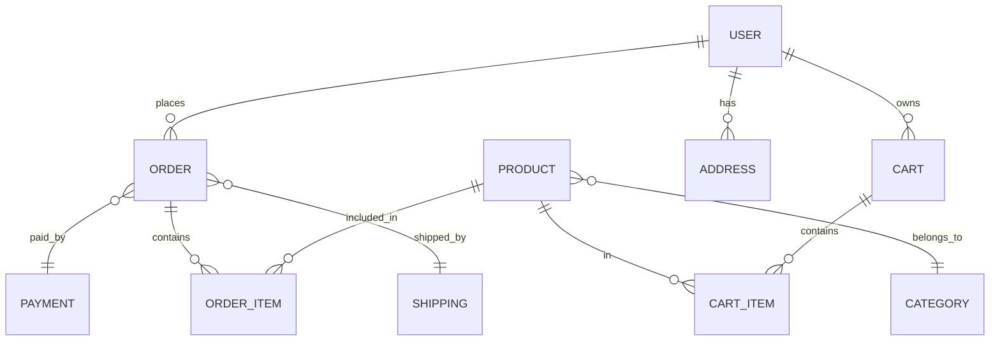

# Phân tích nghiệp vụ hệ thống thương mại điện tử

## 1. Quản lý người dùng (User Management)
- Đăng ký, đăng nhập, xác thực tài khoản
- Quản lý thông tin cá nhân (cập nhật địa chỉ, số điện thoại, email, mật khẩu)
- Phân quyền (khách hàng, quản trị viên, nhân viên, nhà cung cấp...)

## 2. Quản lý sản phẩm (Product Management)
- Thêm, sửa, xóa sản phẩm
- Quản lý danh mục, thuộc tính sản phẩm (màu sắc, kích thước, thương hiệu...)
- Quản lý tồn kho (số lượng, cảnh báo hết hàng)
- Quản lý hình ảnh, mô tả sản phẩm

## 3. Quản lý đơn hàng (Order Management)
- Tạo đơn hàng (thêm vào giỏ hàng, đặt hàng)
- Xử lý đơn hàng (xác nhận, đóng gói, vận chuyển, giao hàng)
- Theo dõi trạng thái đơn hàng (chờ xác nhận, đang giao, đã giao, hủy)
- Quản lý đổi/trả hàng

## 4. Quản lý giỏ hàng (Cart Management)
- Thêm, sửa, xóa sản phẩm trong giỏ hàng
- Tính toán tổng tiền, phí vận chuyển, mã giảm giá

## 5. Thanh toán (Payment)
- Tích hợp các cổng thanh toán (COD, chuyển khoản, ví điện tử, thẻ tín dụng)
- Xử lý giao dịch thanh toán
- Quản lý hóa đơn, biên lai

## 6. Quản lý khách hàng (Customer Management)
- Quản lý thông tin khách hàng
- Lịch sử mua hàng
- Chăm sóc khách hàng, hỗ trợ trực tuyến

## 7. Quản lý khuyến mãi, mã giảm giá (Promotion & Coupon Management)
- Tạo, phân phối mã giảm giá
- Quản lý chương trình khuyến mãi
- Áp dụng khuyến mãi vào đơn hàng

## 8. Quản lý vận chuyển (Shipping Management)
- Tính phí vận chuyển
- Theo dõi trạng thái giao hàng
- Tích hợp đơn vị vận chuyển

## 9. Báo cáo & Thống kê (Reporting & Analytics)
- Báo cáo doanh thu, đơn hàng, sản phẩm bán chạy
- Thống kê khách hàng, hiệu quả marketing

## 10. Quản trị hệ thống (System Administration)
- Quản lý người dùng hệ thống
- Phân quyền, bảo mật
- Sao lưu, phục hồi dữ liệu

---

### Sơ đồ tổng quan nghiệp vụ (Business Use Case Diagram)



---

# Thiết kế hệ thống backend bằng Spring Boot

## 1. Kiến trúc tổng thể
- RESTful API
- Spring Boot (Java)
- Database: MySQL/PostgreSQL
- ORM: Spring Data JPA
- Bảo mật: Spring Security, JWT
- Quản lý dependency: Maven/Gradle

## 2. Các module chính
1. User Service: Quản lý người dùng, xác thực, phân quyền
2. Product Service: Quản lý sản phẩm, danh mục, tồn kho
3. Order Service: Quản lý đơn hàng, trạng thái đơn hàng
4. Cart Service: Quản lý giỏ hàng
5. Payment Service: Xử lý thanh toán
6. Promotion Service: Quản lý mã giảm giá, khuyến mãi
7. Shipping Service: Quản lý vận chuyển
8. Report Service: Báo cáo, thống kê

## 3. Thiết kế cơ sở dữ liệu (ví dụ)

### Entity Diagram (giản lược)



## 4. Ví dụ các entity cơ bản (Java)

### User
```java
@Entity
public class User {
    @Id @GeneratedValue
    private Long id;
    private String username;
    private String password;
    private String email;
    // ... các trường khác
}
```

### Product
```java
@Entity
public class Product {
    @Id @GeneratedValue
    private Long id;
    private String name;
    private String description;
    private BigDecimal price;
    private int stock;
    // ... các trường khác
}
```

### Order
```java
@Entity
public class Order {
    @Id @GeneratedValue
    private Long id;
    @ManyToOne
    private User user;
    private LocalDateTime orderDate;
    private String status;
    // ... các trường khác
}
```

## 5. Ví dụ API endpoints

| Method | Endpoint              | Chức năng                |
|--------|-----------------------|--------------------------|
| POST   | /api/auth/register    | Đăng ký                  |
| POST   | /api/auth/login       | Đăng nhập                |
| GET    | /api/products         | Lấy danh sách sản phẩm   |
| POST   | /api/cart             | Thêm vào giỏ hàng        |
| POST   | /api/orders           | Tạo đơn hàng             |
| GET    | /api/orders/{id}      | Xem chi tiết đơn hàng    |
| POST   | /api/payment          | Thanh toán đơn hàng      |

## 6. Bảo mật
- Sử dụng Spring Security cho xác thực và phân quyền
- JWT cho xác thực stateless
- Mã hóa mật khẩu với BCrypt

## 7. Cấu trúc thư mục Spring Boot (gợi ý)

```
src/
 └── main/
     ├── java/
     │    └── com.example.ecommerce/
     │         ├── controller/
     │         ├── service/
     │         ├── repository/
     │         ├── model/
     │         └── security/
     └── resources/
          ├── application.properties
          └── ...
```

## 8. Các bước triển khai
1. Khởi tạo project Spring Boot (Spring Initializr)
2. Thiết kế database, tạo entity, repository
3. Xây dựng service, controller cho từng module
4. Tích hợp bảo mật (Spring Security, JWT)
5. Viết unit test, tích hợp test
6. Deploy lên server (Docker, Heroku, AWS...)

---

# Tài liệu mở rộng hệ thống Spring Boot thương mại điện tử

## 1. Validate dữ liệu đầu vào
- Sử dụng các annotation như `@NotNull`, `@Email`, `@Size`, `@Min`, `@Max` trong entity/model để kiểm tra dữ liệu.
- Sử dụng `@Valid` trong controller để tự động kiểm tra dữ liệu đầu vào.

**Ví dụ:**
```java
@NotNull
@Size(min = 3, max = 50)
private String username;

@Email
private String email;
```

Trong controller:
```java
@PostMapping
public User createUser(@Valid @RequestBody User user) {
    return userService.createUser(user);
}
```

## 2. Xử lý lỗi (Exception Handling)
- Tạo class `@ControllerAdvice` để xử lý lỗi chung cho toàn bộ API.
- Trả về thông báo lỗi rõ ràng cho client.

**Ví dụ:**
```java
@RestControllerAdvice
public class GlobalExceptionHandler {
    @ExceptionHandler(MethodArgumentNotValidException.class)
    public ResponseEntity<?> handleValidationException(MethodArgumentNotValidException ex) {
        Map<String, String> errors = new HashMap<>();
        ex.getBindingResult().getFieldErrors().forEach(error ->
            errors.put(error.getField(), error.getDefaultMessage()));
        return ResponseEntity.badRequest().body(errors);
    }
}
```

## 3. Logic nghiệp vụ nâng cao
- Kiểm tra tồn kho khi đặt hàng: Không cho phép đặt hàng nếu sản phẩm hết hàng.
- Tự động cập nhật số lượng tồn kho khi đơn hàng thành công.
- Kiểm tra mã giảm giá hợp lệ khi áp dụng vào đơn hàng.
- Chỉ cho phép người dùng sửa/xóa giỏ hàng của chính mình.
- Không cho phép tạo hai tài khoản cùng email.

**Ví dụ kiểm tra tồn kho khi đặt hàng:**
```java
@Override
public Order createOrder(Order order) {
    for (OrderItem item : order.getItems()) {
        Product product = productRepository.findById(item.getProductId()).orElseThrow();
        if (product.getStock() < item.getQuantity()) {
            throw new RuntimeException("Sản phẩm " + product.getName() + " không đủ hàng.");
        }
        product.setStock(product.getStock() - item.getQuantity());
        productRepository.save(product);
    }
    return orderRepository.save(order);
}
```

## 4. API nâng cao
- Tìm kiếm sản phẩm theo tên, danh mục, giá: `/api/products/search?name=...&category=...&minPrice=...&maxPrice=...`
- Phân trang (Pagination): Sử dụng `Pageable` trong Spring Data JPA.
- Lọc đơn hàng theo trạng thái, ngày tạo.
- API xác thực, phân quyền (Spring Security, JWT).

**Ví dụ tìm kiếm sản phẩm:**
```java
@GetMapping("/search")
public List<Product> searchProducts(
    @RequestParam(required = false) String name,
    @RequestParam(required = false) Long categoryId,
    @RequestParam(required = false) BigDecimal minPrice,
    @RequestParam(required = false) BigDecimal maxPrice
) {
    // Gọi service để filter sản phẩm theo các tiêu chí
}
```

## 5. Gợi ý các bước tiếp theo
- Bổ sung các annotation validate vào entity.
- Tạo class `GlobalExceptionHandler` để xử lý lỗi chung.
- Thêm logic kiểm tra nghiệp vụ vào service (ví dụ: kiểm tra tồn kho, kiểm tra mã giảm giá).
- Thêm các API nâng cao như tìm kiếm, phân trang, lọc dữ liệu.
- Tích hợp Spring Security để bảo vệ các endpoint nhạy cảm.

---

## Hướng dẫn test API (RESTful)

Bạn có thể test các API của hệ thống bằng Postman, curl hoặc bất kỳ HTTP client nào. Dưới đây là các ví dụ phổ biến:

### 1. User API
- **Lấy tất cả user:**
  ```sh
  curl -X GET http://localhost:8080/api/users
  ```
- **Tạo user mới:**
  ```sh
  curl -X POST http://localhost:8080/api/users \
    -H "Content-Type: application/json" \
    -d '{
      "username": "testuser",
      "password": "12345678",
      "email": "test@example.com",
      "fullName": "Test User",
      "role": "USER"
    }'
  ```

### 2. Product API
- **Lấy tất cả sản phẩm:**
  ```sh
  curl -X GET http://localhost:8080/api/products
  ```
- **Tạo sản phẩm mới:**
  ```sh
  curl -X POST http://localhost:8080/api/products \
    -H "Content-Type: application/json" \
    -d '{
      "name": "Sản phẩm test",
      "description": "Mô tả sản phẩm",
      "price": 100000,
      "stock": 10,
      "categoryId": 1
    }'
  ```

### 3. Category API
- **Lấy tất cả danh mục:**
  ```sh
  curl -X GET http://localhost:8080/api/categories
  ```
- **Tạo danh mục mới:**
  ```sh
  curl -X POST http://localhost:8080/api/categories \
    -H "Content-Type: application/json" \
    -d '{
      "name": "Đồ uống",
      "description": "Các loại nước giải khát"
    }'
  ```

### 4. Cart API
- **Lấy giỏ hàng của user:**
  ```sh
  curl -X GET http://localhost:8080/api/carts/user/{userId}
  ```
- **Thêm sản phẩm vào giỏ:**
  ```sh
  curl -X POST http://localhost:8080/api/carts/items \
    -H "Content-Type: application/json" \
    -d '{
      "cartId": 1,
      "productId": 2,
      "quantity": 3
    }'
  ```

### 5. Order API
- **Lấy tất cả đơn hàng:**
  ```sh
  curl -X GET http://localhost:8080/api/orders
  ```
- **Tạo đơn hàng mới:**
  ```sh
  curl -X POST http://localhost:8080/api/orders \
    -H "Content-Type: application/json" \
    -d '{
      "userId": 1,
      "items": [
        { "productId": 2, "quantity": 1, "price": 100000 }
      ],
      "status": "PENDING"
    }'
  ```

### 6. Payment API
- **Lấy tất cả thanh toán:**
  ```sh
  curl -X GET http://localhost:8080/api/payments
  ```
- **Tạo thanh toán mới:**
  ```sh
  curl -X POST http://localhost:8080/api/payments \
    -H "Content-Type: application/json" \
    -d '{
      "orderId": 1,
      "amount": 100000,
      "method": "CASH",
      "status": "PAID"
    }'
  ```

### 7. Shipping API
- **Lấy tất cả vận chuyển:**
  ```sh
  curl -X GET http://localhost:8080/api/shippings
  ```
- **Tạo vận chuyển mới:**
  ```sh
  curl -X POST http://localhost:8080/api/shippings \
    -H "Content-Type: application/json" \
    -d '{
      "orderId": 1,
      "shippingAddress": "123 Đường ABC, Quận 1",
      "status": "SHIPPING"
    }'
  ```

### 8. Coupon API
- **Lấy tất cả mã giảm giá:**
  ```sh
  curl -X GET http://localhost:8080/api/coupons
  ```
- **Tạo mã giảm giá mới:**
  ```sh
  curl -X POST http://localhost:8080/api/coupons \
    -H "Content-Type: application/json" \
    -d '{
      "code": "SALE2025",
      "discount": 10.0,
      "expiryDate": "2025-12-31",
      "usageLimit": 100
    }'
  ```

---

**Lưu ý:**
- Thay `{userId}`, `{cartId}`, `{orderId}`... bằng giá trị thực tế trong hệ thống của bạn.
- Có thể dùng Postman để import các request này và test dễ dàng hơn.
- Nếu API trả về lỗi, kiểm tra lại dữ liệu đầu vào và log ứng dụng.
``` 